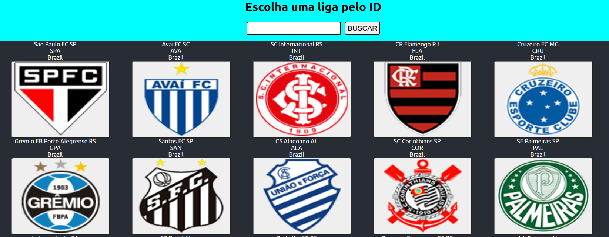

# Getting Started with Create React App

This project was bootstrapped with [Create React App](https://github.com/facebook/create-react-app).

## Available Scripts
## Fazer um `git clone git@github.com:reinaldoper/ligasDeTimes.git`

In the project directory, you can run:
### `Rodar a aplicação`
 
[Link da aplicação](https://classy-vacherin-a43e5f.netlify.app/)
 
 ### `npm install`
- Baixar as dependencias do projeto

### `npm start`
- Para rodar a aplicação em uma máquina local.

### `imagem de uma das telas de pesquisa:`

 

Runs the app in the development mode.\
Open [http://localhost:3000](http://localhost:3000) to view it in your browser.

### `npm run build`

This section has moved here: [https://facebook.github.io/create-react-app/docs/troubleshooting#npm-run-build-fails-to-minify](https://facebook.github.io/create-react-app/docs/troubleshooting#npm-run-build-fails-to-minify)
